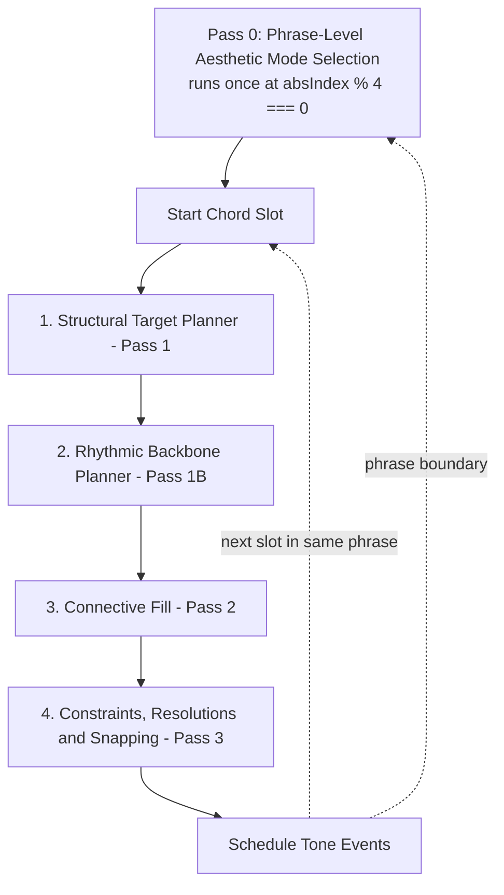

I read through the full `melodyGenerator.js` (all ~2050 lines) alongside the plan. Here's my honest take.

**The core paradigm shift is theoretically sound — and it's the right diagnosis.**

What you have now is essentially a per-sixteenth-note loop where dozens of independent systems each get a vote: rhythmic templates, phrase subdivisions, density/rest rolls, hookRhythm gating, a "make sure at least 3 notes play" patch, a macro contour target, motif-family transposition, ~15 multiplicative weight adjustments on pitch candidates (chord-tone bonus, diatonic penalty, bass-doubling penalty, register-separation penalty, leap/step bias, color-tone bias, jazz inner-voice de-emphasis...), surprise-gesture overrides, contrary-motion forcing, jazz enclosure insertions, and post-hoc resolution rules. None of these have an explicit hierarchy — they're all nudging the same coin-flip at the same level. That's exactly why the output feels directionless: there's no "spine" the ornamentation hangs off of, just a pile of competing local heuristics.

The plan's structure — plan a few structural anchors first (Pass 1), pick a coherent "personality" for how to decorate them (Aesthetic Mode), generate connective material consistent with that personality (Pass 2), then resolve/snap — mirrors how composition pedagogy actually describes melody (structural tones vs. embellishing tones, with a consistent textural character per phrase). If implemented faithfully, this should produce far more "intentional"-sounding lines than the current weighted-roll soup. So directionally, yes, I agree with this plan more than I'd expect to disagree.

**But as written, it's a conceptual sketch, not an implementation spec, and there are several gaps that could mean it just reshuffles the existing chaos rather than fixing it.**

Rhythm is the biggest gap. You said the output isn't rhythmically satisfying either, but the plan barely touches rhythm — it folds "rhythmic ornamentation" into Pass 2 alongside pitch connectors. The current rhythm generation is itself a stack of competing systems (genre `RHYTHMIC_TEMPLATES` × `phraseSubdivisions` × per-step density/rest probability rolls × `hookRhythm` motif gating × the "ensure ≥3 notes" post-process). That's the rhythmic mirror of the pitch problem, and it needs its own structural-pass treatment — e.g., a rhythmic backbone that decides *where in time* the structural anchors and phrase-level events fall, with the Aesthetic Mode then determining subdivision character (smooth 8ths for Cantabile, syncopated hooks for Declamatory, 16th-note runs for Virtuoso) around that backbone. Without that, Pass 1/Pass 2 might produce a beautifully planned pitch contour scheduled onto the same erratic rhythm grid as today.

Second, there's already a long-range contour system (`macroTargetPlan` — arch/staircase/valley/launch across the whole piece) that produces a per-slot target pitch. The new per-slot Structural Target Planner is also producing target pitches, just at a finer grain. If these two aren't explicitly reconciled (e.g., the macro target constrains/seeds the local anchor selection rather than the two competing independently), you'll recreate the very "two systems pulling toward different notes" problem this plan exists to solve.

Third, countermelody isn't mentioned at all. It runs its own independent weighted-selection logic (contrary/harmonize/call-response modes) completely separate from the melody pipeline. If melody gets a structured backbone-plus-decoration treatment and countermelody stays as-is, you may end up with a coherent lead line over a still-wandering counter-voice — which will sound like a mismatch rather than an ensemble.

Fourth, tuning generality. The codebase is explicitly EDO-agnostic (`periodSize`, `divisions`, `getEffectiveTuning`, custom `chordNotes`/`pcOffsets`), but the plan's voice-leading language is framed in fixed intervals ("leaps of at most a 4th/5th," "half-step resolution"). These need to be expressed as scale-degree counts relative to the active chord-scale rather than semitone counts, or the rules will misbehave outside 12-EDO.

Fifth, some of "Harmonic Resolution & Snapping" already exists — the isolated-note guard (forcing isolated notes to chord tones, falling back to base-scale tones) and leading-tone resolution (`forceTonicNext`/`isLeadingTone`) are already implemented today. The plan presents these as new work, which makes it hard to judge the real scope — worth explicitly auditing which existing mechanisms are kept, folded into the new passes, or removed.

Sixth, the Aesthetic Mode selection rule ("based on chord tension/emotion, genre, and progression progress") is a placeholder rather than an algorithm, similar in vagueness to the existing tension-band thresholds (`currentTension < 0.25/0.55/0.7`). It also needs a smoothing/persistence rule — if the mode can flip from Cantabile to Virtuoso to Declamatory bar-to-bar with no continuity constraint, you've just moved the "competing personalities every bar" problem up one level of abstraction.

**Net assessment:** the overall shape — plan structural anchors, pick one coherent decoration style per phrase, fill in, then resolve — is the right call and should genuinely move things toward "professional," especially for melodic shape and phrase coherence. But given this is effectively a rewrite of the core 600-line scheduling loop inside a 2000-line file with several adjacent subsystems (macro planner, motif families, countermelody, rhythmic templates, EDO support), I'd push back on treating this plan as implementation-ready. Before coding, I'd want: (1) an explicit subsystem-by-subsystem map of keep/fold/remove for everything currently in the loop, (2) a companion rhythmic-backbone section analogous to the Structural Target Planner — since rhythm is half your complaint and the plan doesn't address it, (3) an explicit reconciliation between macro contour and per-slot anchors, and (4) a statement on countermelody's fate and on scale-degree-based (not semitone-based) interval rules for EDO support.

______
The following addendum is meant to sit alongside the original plan — it maps every existing mechanism in melodyGenerator.js to a destination in the new architecture, adds the rhythm-side planner the original plan was missing, gives the Aesthetic Mode logic concrete thresholds and a persistence rule, reconciles the macro contour with per-slot anchors, makes the voice-leading rules EDO-safe, and gives countermelody a coherent relationship to the melody's mode rather than running independently.
The phased order in §7 is the part I'd push hardest on before any code changes — given the size of the existing file, doing the rhythm backbone first (and confirming the genre: 'none' Jest tests still pass) gives you a checkpoint before touching the pitch-selection logic, which is where most of the current complexity lives.

# Addendum: Rhythmic Backbone Planner, Aesthetic Mode Logic, and Subsystem Migration Map

This addendum extends the "Two-Pass Generator + Aesthetic Modes" plan with the pieces needed to make it implementation-ready against the current `melodyGenerator.js`. It assumes the original plan's four stages (Structural Target Planner → Aesthetic Mode Selection → Connective/Rhythmic Ornamentation → Harmonic Resolution & Snapping) as the target architecture, and proposes where every existing mechanism in the current file lands within that architecture.

---

## 1. Subsystem Migration Map

Before any rewrite, every existing mechanism should have an explicit destination. This avoids ending up with the new pitch system layered on top of the old rhythm/weighting system (which would just move the "competing rules" problem rather than solve it).

| Current Mechanism | Destination | Notes |
|---|---|---|
| `macroTargetPlan` (arch/staircase/valley/launch contour, roles) | **Keep** — becomes the seed input to Pass 1 | See §4. Currently consumed in 3 places with inconsistent effect; should become a single input. |
| `RHYTHMIC_TEMPLATES` (genre × energy 16-step grids) | **Replace** | Folded into per-Aesthetic-Mode subdivision palettes (§2). |
| `generatePhraseSubdivisions` (4 random profiles) | **Replace** | Folded into the Phrase Activity Curve (§2). |
| `stepPlaysMap` pre-pass + "ensure ≥3 notes" patch | **Remove** | Activity curve is designed to never under-produce, so the patch becomes unnecessary. |
| `hookRhythm` gating | **Replace** | Hook/connector/cadence become *ornamentation material* (Pass 2), not a rhythm gate. |
| Motif families (`generateMotifFamily`, mutation, retrograde/inversion/sequence) | **Fold into Pass 2** | Useful as a source of *shapes* for connective material per mode, not as the primary generator. |
| Weighted pitch candidate selection (~15 multiplicative factors) | **Mostly remove** | Anchors (Pass 1) become deterministic; connective tones (Pass 2) use mode-specific rule sets (passing tone, neighbor tone, appoggiatura, run) instead of weight soup. A few factors (bass-doubling avoidance, register separation from countermelody) survive as **Pass 3 constraints/checks**, not probability nudges. |
| Surprise gestures (`surpriseQuotient`, deceptive resolution, leap+forceContrary) | **Keep, re-scope** | Becomes a Pass 1 decision (an anchor *is* the surprise — deceptive resolution or octave displacement) rather than a post-hoc override on whatever Pass 2 produced. |
| Jazz enclosure | **Fold into Pass 2** | Part of the Declamatory/Virtuoso ornamentation toolkit when `genre` is jazz/blues. |
| Isolated-note guard | **Keep, consolidate into Pass 3** | Already mostly implemented; just becomes the canonical home for this rule instead of being duplicated. |
| Leading-tone resolution / `forceTonicNext` | **Keep → Pass 3** | Already implemented; consolidate. |
| Narrative state (`consecutiveSteps`, `lowRegisterBars`, `motifRepeats`) | **Keep, simplified** | Feeds Aesthetic Mode persistence and register management (§3, §4) rather than ad-hoc per-step checks. |
| Swing ratio | **Keep** | Applies as a micro-timing layer in Pass 1B, uniformly, rather than scattered across subdivision-specific branches. |
| `applyOrnaments` (grace notes, blue-note bends) | **Fold into Pass 2** | Genre-specific micro-decoration, naturally a Cantabile/Blues-mode behavior. |
| Countermelody (`contrary`/`harmonize`/`call-response`) | **Keep core, re-select via melody mode** | See §6. |
| `phraseLocalScaleOffset` (local chord-scale substitution) | **Keep** | Mostly orthogonal; feeds chord-scale selection consumed by Pass 1. |
| EDO/tuning (`periodSize`, `divisions`, `pcOffsets`, `adjustScalePitches`) | **Keep, becomes the unit system** | All new rules expressed in scale-degree terms via `validPitches` (§5), so this infrastructure is reused as-is. |

---

## 2. Rhythmic Backbone Planner (Pass 1B)

This is the rhythm-side companion to the Structural Target Planner, and addresses the half of your complaint the original plan doesn't cover. Right now rhythmic density emerges from the *intersection* of five independent random processes per 16th-note step: `activeDensity` roll, `restProbability` roll, `activeTemplate` lookup, `hookRhythm` check, and the post-hoc "ensure ≥3 notes" patch. None of these know about each other, so the result has no overall shape — it's uniform noise rather than a phrase that breathes.

**Proposal — three layers, planned top-down per 4-chord phrase:**

**Layer 1: Phrase Activity Curve.** Once per phrase (the existing `absIndex % 4 === 0` boundary), compute a single 0–1 activity value per chord slot, derived from `macroSlotTarget.role` (build/climax → high, release/resolution → low, statement → medium) and `tensionCurveValue`. This single curve replaces `generatePhraseSubdivisions`'s four competing random profiles *and* the per-step `activeDensity`/`restProbability` rolls *and* the macro-planner's separate density overrides — one source of truth for "how busy is this slot."

**Layer 2: Mode Subdivision Palette.** Each slot has exactly one Aesthetic Mode (§3), which defines an *allowed* subdivision palette:

| Aesthetic Mode | Subdivision Palette | Character |
|---|---|---|
| Cantabile | {1, 2}, occasional 3 | Mostly quarter/eighth notes, stepwise |
| Sighs & Suspensions | {1, 2} + a *fixed* appoggiatura-pair pattern | The "extra" note is the appoggiatura itself, not a free subdivision |
| Declamatory | {1, 2, 4} drawn from a small fixed library of syncopated cells | Repeats a cell for motivic identity rather than re-rolling each step |
| Virtuoso | {4, 6, 8} as one continuous run gesture | Generated as a single scale/arpeggio traversal, not independently rolled per 16th |

The Layer 1 activity value selects *which* slot/beat within the mode's palette gets the busier option — e.g., beat 1 always carries the anchor; beat 3 gets the mode's higher-density option only if activity is high.

**Layer 3: Anchors always play.** Anchors from Pass 1 are placed first and are never subject to a density roll — Pass 1B only decides placement/count of *connective* events around them. This eliminates the current failure mode where a structurally important note can get silenced by `stepPlaysMap` and then has to be patched back in.

**Micro-timing.** The existing swing-ratio computation is kept as-is, applied uniformly across all modes as a final micro-timing pass — it's already a clean, isolated piece of logic and doesn't need restructuring.

---

## 3. Aesthetic Mode Decision Table & Persistence

**Inputs available per slot:**
- `parsedChord.quality` (major / minor / minor7 / dominant / diminished / augmented / suspended) via `deduceChordRootAndQuality`
- `macroSlotTarget.role` (statement / build / climax / release / resolution), if macro planner enabled
- `genre`
- `currentTension`
- phrase position (`absIndex % 4`)
- previous mode (for persistence)

**Base mode by chord quality:**

| Chord Quality | Primary Mode | High-Tension Alternate |
|---|---|---|
| Major triad | Cantabile | Declamatory (if role = build) |
| Minor triad | Cantabile | Sighs & Suspensions (mid-phrase) |
| Minor 7th | Sighs & Suspensions | Cantabile |
| Dominant 7th | Declamatory | Virtuoso (if role = climax) |
| Diminished | Sighs & Suspensions | Declamatory |
| Augmented | Sighs & Suspensions | Virtuoso |
| Suspended | Cantabile | Declamatory |

**Macro-role overrides** (applied after the lookup above):
- `climax` → force Virtuoso, unless chord quality is diminished/augmented, in which case an intensified Sighs is the allowed alternative.
- `resolution` → force Cantabile.
- `release` → bias toward Cantabile/Sighs; suppress Virtuoso/Declamatory.
- `build` → bias toward Declamatory, *or* intensify the current mode's Layer 2 palette — doesn't necessarily force a mode change (this is where persistence matters most).
- `statement` → use the chord-quality lookup as-is; this establishes the section's "default" mode.

**Persistence rule:** Mode is chosen **once per phrase**, at the same `absIndex % 4 === 0` boundary where `phraseSubdivisions`/`phraseLocalScaleOffset` are currently reset, and holds for all four slots unless a macro-role override (climax/resolution) fires mid-phrase. Variation *within* a phrase comes from the activity curve intensifying the same mode's palette (e.g., Cantabile at low tension = mostly stepwise quarters; Cantabile at higher tension = more eighth-note passing tones, same melodic character) — not from switching modes. This is the key fix against "personality whiplash."

**Genre interaction:** genre constrains which modes are *eligible* — e.g., `genre: 'classical'` might route Declamatory's syncopation toward ornamental turns instead; `genre: 'jazz'`/`'blues'` enables jazz-enclosure material inside Declamatory/Virtuoso. `genre: 'none'` → always Cantabile, which both matches "no special character" and keeps the Jest baseline tests (which run under `genre: 'none'`) from needing to cover four modes.

---

## 4. Reconciling the Macro Contour with Local Anchors

Currently `macroTargetPlan[absIndex].targetPitch` is consumed in three places with different effects: as the literal pitch of the first note when the macro planner is enabled, as a weight bonus for nearby candidates later in the loop, and (in non-macro mode) as a separate `targetPitch` used for a ±4-semitone "preferred candidates" filter. Three consumers, three slightly different behaviors.

**Proposal:** `macroTargetPlan` becomes a Pass 1-only input.

- **Anchor 1** (beat 1, always present) = the chord tone from `activeChordTones` closest to `macroSlotTarget.targetPitch`. One `findClosest` call, deterministic.
- **Anchor 2** (beat 3, only when the slot has ≥2 beats *and* role ∈ {build, climax, statement}) = a different chord tone within a small scale-degree distance of Anchor 1 (§5), chosen to lean toward *next slot's* `macroSlotTarget.targetPitch` — i.e., Anchor 2 starts the voice-leading motion the next slot will continue.
- If the macro planner is disabled, fall back to the current `chordToneAnchor`/`anchorTarget` logic (chord tone nearest `globalPrevPitch`), which is already reasonable for that case.

This collapses three inconsistent consumers of "target pitch" into one deterministic step at the start of Pass 1.

---

## 5. Scale-Degree-Based Voice Leading (EDO Generality)

The codebase is explicitly tuning-agnostic (`periodSize`, `divisions`, `getEffectiveTuning`, custom `chordNotes`/`pcOffsets` via `adjustScalePitches`), but plan language like "4th/5th" or "half-step" is semitone-specific. All voice-leading rules should instead be expressed as **index distances within `validPitches`** (the already tuning-adjusted scale+chord-tone pool):

- **STEP** = adjacent `validPitches` indices (1 scale degree), regardless of how many EDO-steps that represents.
- **SMALL_LEAP** = 2–3 scale degrees.
- **LARGE_LEAP** = 4+ scale degrees (climax-only).

Rewriting the original plan's language accordingly:
- *"Conjunct motion: leaps of at most a 4th/5th"* → "anchor-to-anchor leaps of at most 3 scale degrees in `validPitches`, except role = climax which permits up to 5."
- *Sighs Mode "leap to a 9th/11th, resolve down by half-step/step"* → "leap of 4–6 scale degrees to a pitch not in `chordTonePcSet`, then resolve down by 1 scale degree to the nearest chord tone."
- *Virtuoso "16th-note runs"* → N consecutive `validPitches` indices traversed in one direction, where N comes from the Pass 1B subdivision count — independent of how many semitones each step represents.

Because `validPitches`/`buildScalePitches` already bake in `periodSize`/`divisions`/custom offsets, expressing rules this way makes them automatically correct in any EDO without extra conditional logic.

---

## 6. Countermelody Integration

Rather than giving countermelody its own independent Aesthetic Mode selection (doubling the decision surface), derive its behavior from the melody's Pass-1 mode for the phrase:

| Melody Aesthetic Mode | Countermelody Behavior |
|---|---|
| Cantabile | Existing `contrary` mode — stepwise contrary motion, similar density to melody |
| Sighs & Suspensions | Sustained tones on chord root/5th — avoids stacking two appoggiaturas |
| Declamatory | Sparse punctuation, placed in melody's rest beats (call-response-lite), reinforcing the hook rhythm |
| Virtuoso | Sustained pedal tone or near-silent — steps back during melody runs to avoid clutter |

The existing `contrary`/`harmonize`/`call-response` machinery is retained largely as-is; the change is *which one fires* and *how dense it is*, driven by the melody's mode rather than an independent `countermelodyMode` random/setting choice. This is what gives the two voices a coherent relationship instead of two unrelated stochastic processes running in parallel.

---

## 7. Suggested Implementation Order

Given the scope (this is effectively a rewrite of the ~600-line core loop inside a 2000-line file with several adjacent subsystems), a phased rollout reduces risk and keeps the `genre: 'none'` Jest baseline stable longest:

1. **Rhythmic Backbone Planner (§2)** — replaces `phraseSubdivisions`/`stepPlaysMap`/`hookRhythm` gating. Verify existing tests still pass (genre `'none'` keeps the simple grid), add new tests for activity-curve shape.
2. **Structural Target Planner + macro reconciliation (§1, §4)** — replaces weighted selection for anchor positions only; non-anchor positions temporarily keep the old weighted selection.
3. **Aesthetic Mode table + Pass 2 ornamentation (§3)** — replaces remaining weighted selection for connective tones, mode-by-mode.
4. **Countermelody mode mapping (§6)**.
5. **Cleanup** — remove now-dead code: superseded weight factors, `RHYTHMIC_TEMPLATES`, `generatePhraseSubdivisions`, and fold the surprise-quotient mechanism into the Pass 1 deceptive-anchor logic.

---

## Updated Verification Plan Additions

In addition to the original plan's tests (isolated notes → stable chord tones; structural targets on strong beats; contour leaps within voice-leading bounds), add:

- **Activity curve shape**: assert phrase-level note density follows the build/climax/release/resolution role sequence (not flat or random per-slot).
- **Mode persistence**: assert Aesthetic Mode does not change mid-phrase except via the documented climax/resolution overrides.
- **Macro/local agreement**: assert Anchor 1's pitch class is always a member of `activeChordTones` and within the scale-degree distance of `macroSlotTarget.targetPitch` defined in §4.
- **EDO regression**: run the voice-leading assertions under at least one non-12-EDO tuning to confirm scale-degree-based rules (§5) hold.
- **Countermelody coherence**: assert countermelody density during Virtuoso-mode melody slots stays below a fixed threshold (no clutter).

*******************
Patch:

This patch should slot in cleanly: the corrected diagram adds Pass 0 as a phrase-level step feeding both Pass 1B and Pass 2, the decision table gives Pass 0 something concrete to compute (chord quality → role override → genre gating, in that order), and the mid-phrase override section gives the persistence rule an actual trigger condition instead of just saying "unless overridden." The Declamatory connective-fill rule and the macro/local agreement test were the two smaller gaps from the previous round.
One thing worth flagging if you send this back to Gemini: the decision table's "High-Tension Alternate" column still isn't wired to a concrete threshold (e.g., what currentTension value actually triggers Dominant7→Virtuoso instead of Dominant7→Declamatory at climax). I left that as Step 1 vs. Step 2 — the macro-role override effectively is the trigger for most of those alternates — but if a chord quality's alternate is meant to fire on tension alone (independent of role), that threshold still needs a number. Worth a clarifying pass once you see how it reads alongside the rest.
# Patch: Pass 0 (Phrase-Level Aesthetic Mode Selection)

This patch addresses two gaps in the revised plan: (1) the Aesthetic Mode *selection* criteria were dropped (only the persistence rule survived), and (2) Pass 1B's mode-dependent subdivision palettes ran before a mode existed to consult. It also fills in the missing Declamatory connective-fill rule and re-adds the macro/local agreement test.

---

## Corrected Pipeline Diagram

Pass 0 runs **once per 4-slot phrase**, before any per-slot pass executes. It produces a single `activeAestheticMode` that Pass 1B (subdivision palette) and Pass 2 (connective-fill rules) both read for all four slots in the phrase, subject only to the mid-phrase override below.

---

## Aesthetic Mode Decision Table

Pass 0 evaluates this table using the **chord quality of the phrase's first slot** (the one at `absIndex % 4 === 0`), since the resulting mode governs the whole phrase.

**Step 1 — base mode from chord quality** (via `deduceChordRootAndQuality`):

| Chord Quality | Primary Mode | High-Tension Alternate |
|---|---|---|
| Major triad | Cantabile | Declamatory (if role = build) |
| Minor triad | Cantabile | Sighs & Suspensions (mid-phrase) |
| Minor 7th | Sighs & Suspensions | Cantabile |
| Dominant 7th | Declamatory | Virtuoso (if role = climax) |
| Diminished | Sighs & Suspensions | Declamatory |
| Augmented | Sighs & Suspensions | Virtuoso |
| Suspended | Cantabile | Declamatory |

**Step 2 — macro-role override**, evaluated against the phrase's first slot's `macroSlotTarget.role`, applied after Step 1:

- `resolution` → force Cantabile.
- `climax` → force Virtuoso, unless chord quality is diminished/augmented, in which case an intensified Sighs is the allowed alternative.
- `release` → bias toward Cantabile/Sighs; suppress Virtuoso/Declamatory as candidates.
- `build` → bias toward Declamatory, *or* intensify the chosen mode's Pass 1B/Pass 2 palette without changing the mode itself.
- `statement` → use the Step 1 result as-is.

**Step 3 — genre gating**, applied last:

- `genre: 'none'` → always Cantabile, overriding Steps 1–2. Keeps the baseline/test path simple.
- `genre: 'classical'` → Declamatory keeps its identity but its Pass 2 rule set routes syncopation into ornamental turns instead of hard accents.
- `genre: 'jazz' | 'blues'` → Declamatory and Virtuoso both gain access to the jazz-enclosure material (per the migration map) in Pass 2.

---

## Mid-Phrase Override (the only exception to "once per phrase")

The persistence rule says the mode is "persisted unless overridden" but didn't specify the trigger. Concretely:

If a **later** slot in the phrase (`absIndex % 4 !== 0`) has `macroSlotTarget.role` of `climax` or `resolution`, **and** that role differs from what the phrase-level mode implies, the override applies to **that slot only**:

- `climax` slot → Virtuoso for that slot's Pass 1B palette and Pass 2 connective fill.
- `resolution` slot → Cantabile for that slot's Pass 1B palette and Pass 2 connective fill.

Once that slot is scheduled, the phrase's Pass 0 mode resumes for any remaining slots — the override does not "stick" for the rest of the phrase.

---

## Declamatory Connective Fill (Pass 2) — filling the gap

Pass 1B's Declamatory rhythm palette ({1, 2, 4} syncopated cells) was specified, but Pass 2's *pitch* rule for filling those rhythmic slots was not. Proposal:

- Connective notes are drawn from a short **motivic cell** of 2–3 pitches from `validPitches` forming a small interval pattern (e.g., chord tone + neighbor one scale degree away), repeated or transposed to follow the syncopated rhythm cell chosen in Pass 1B.
- **Octave displacement**: occasionally (probability scaling with `currentTension`), one note of the cell is displaced by one `periodSize` — this is the concrete mechanism behind the original plan's "octave displacements" for Declamatory.
- Under `genre: 'jazz' | 'blues'`, jazz-enclosure material may substitute for the cell on strong-beat targets, per the migration map.
- The cell is derived from/transposed relative to **Anchor 1** of the current slot (from Pass 1), so it stays harmonically anchored even while rhythmically syncopated.

---

## Verification Plan Additions

- **Macro/local agreement** (re-added): assert Anchor 1's pitch class is always a member of `activeChordTones` for its slot, and within the scale-degree range (Pass 3 §"Small Leap") of `macroSlotTarget.targetPitch`.
- **Pass 0 determinism**: assert the phrase mode is computed once at `absIndex % 4 === 0` from the first slot's chord quality and role, and is identical across slots 1–3 of the same phrase except where the mid-phrase override applies.
- **Mid-phrase override scope**: assert a climax/resolution override on slot 2 or 3 affects only that slot — slot 4 (or the next phrase's slot 1) reflects the phrase's Pass 0 mode, not the override.
