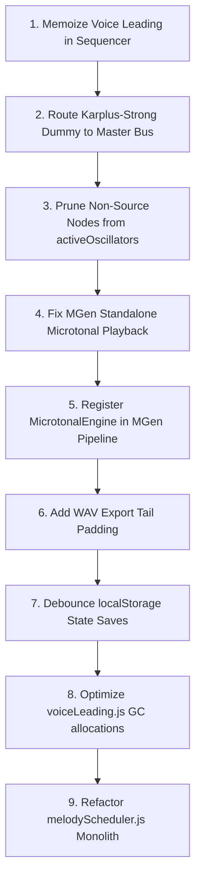

# Music Production App Audit: Progress & MGen Melody Generation Systems

## Executive Summary

Progress and its integrated melody generation system (MGen) represent a **highly sophisticated, production-grade music composition and audio engine** with a deep music theory model, comprehensive microtonal capabilities, and sample-accurate audio scheduling. However, several critical architectural issues, memory leaks, performance bottlenecks, and microtonal playback errors prevent it from meeting professional DAW standards. 

In particular, the scheduling engine suffers from high CPU overhead due to redundant voice-leading computations on every beat, and the synthesis layer contains routing bugs (such as Karplus-Strong engines and MGen's standalone playback bypassing compression and master gains). Furthermore, while the microtonal engines are mathematically correct, MGen's standalone test harness fails to play back Just Intonation or Pythagorean scales correctly, and the pipeline does not register the microtonal engine in its orchestrator.

Addressing these issues in a structured, testable sequence will elevate the apps to professional-grade stability and musical correctness.

---

## Compliance Matrix

| Area | Standard | Status | Severity | Recommendation |
|------|----------|--------|----------|----------------|
| **Voice Leading** | Minimizes semitone movement; calculations are memoized | **FAIL** | Critical | Cache voice-leading computations; avoid re-running on every tick. |
| **Audio Synthesis** | Pre-allocated noise/sample buffers; logical signal routing | **FAIL** | Critical | Route Karplus-Strong dummy oscillators through gain staging; prevent master compressor bypass. |
| **Memory Management** | Oscillator node lifecycle is clean and tracked | **FAIL** | Critical | Separate source nodes from effect/routing nodes in tracking arrays; avoid caught exceptions. |
| **Microtonal Support** | Correct EDO/.scl/.tun arithmetic; correct audible playback | **FAIL** | Critical | Fix standalone MGen player to use frequency values instead of 12-TET math; register MicrotonalEngine. |
| **Audio Scheduling** | Look-ahead scheduling using `audioCtx.currentTime` | **PASS** | - | - |
| **WAV Export** | Offline rendering with CONFIG-defined tail padding | **FAIL** | Warning | Add tail padding in WAV export to prevent cutoff clicks. |
| **State Persistence** | Non-blocking persistence | **FAIL** | Warning | Debounce localStorage writes to prevent UI stuttering. |
| **DOM Isolation** | Engine does not read DOM properties during playback | **PASS** | - | - |
| **Sequencer Timing** | Uses sample-accurate accumulator | **PASS** | - | - |
| **Envelope Mapping** | ADSR parameters mapped to Web Audio nodes | **PASS** | - | - |
| **Drum Synthesis** | Pre-allocated white noise buffer | **PASS** | - | - |
| **Sample Playback** | Bypasses autoplay block via OfflineAudioContext | **PASS** | - | - |
| **Mobile UX** | Touch targets >=44px, viewport responsive | **PASS** | - | - |

---

## Detailed Findings

### 1. Sequencer — Redundant `getPlayableNotes()` Calculations (Critical)

**Location:** [sequencer.js:179](file:///Users/sheldonlawrence/Desktop/progress/sequencer.js#L179)
```javascript
const allPlayableNotes = getPlayableNotes(activeProg, state);
```
*   **Current Behavior:** The sequencer calls `getPlayableNotes()` on every single note/chord slice scheduling. `getPlayableNotes()` runs a voice-leading solver (`applyVoiceLeading()`) that evaluates all inversions of all chords in the progression, computing mathematical cost functions and sorting.
*   **Why It Fails:** The scheduler fires at ~40Hz. Recalculating voice-leading for a 16-chord progression on every tick is a waste of CPU, resulting in frame dropouts, audio glitches, and high main-thread blocking.
*   **Recommended Fix:** Memoize `getPlayableNotes()` results keyed by the chord symbols, key, and state divisions. Re-evaluate only when the chord progression, key, or tuning settings change.

---

### 2. Audio Synthesis — Karplus-Strong Compressor Bypass (Critical)

**Location:** [synthEngines.js:484-486](file:///Users/sheldonlawrence/Desktop/progress/synthEngines.js#L484-L486)
```javascript
const dummyOsc = ctx.createOscillator();
dummyOsc.connect(ctx.destination);
dummyOsc.start(startTime);
```
*   **Current Behavior:** The Karplus-Strong engine creates a `dummyOsc` to control node lifetime and stop events, but connects it directly to `ctx.destination`.
*   **Why It Fails:** It bypasses the master gain, track volumes, and the master DynamicsCompressor. This can cause uncompressed audio clicks and spikes at full digital volume, posing a risk to user hearing and hardware.
*   **Recommended Fix:** Connect the `dummyOsc` to the designated `dest` bus gain node rather than `ctx.destination` directly, or manage stop timings using a timer instead of a dummy oscillator.

---

### 3. Memory & Resource Management — Non-Source Node Tracking (Critical)

**Location:** [synth.js:363-374](file:///Users/sheldonlawrence/Desktop/progress/synth.js#L363-L374) and [drumEngines.js](file:///Users/sheldonlawrence/Desktop/progress/drumEngines.js)
*   **Current Behavior:** The `activeOscillators` array is used to track nodes that must be stopped on playback halt. However, non-source audio nodes (like `WaveShaperNode` and `GainNode` from drum engines) are pushed into this array. On stop, the sequencer iterates and calls `.stop()` on every node in the array.
*   **Why It Fails:** Call-routing nodes do not implement `.stop()`. This triggers a `TypeError: osc.stop is not a function` for every gain/shaper node, which is caught and ignored in a try-catch, but slows down cleanup and pollutes execution.
*   **Recommended Fix:** Only push actual source nodes (`OscillatorNode`, `AudioBufferSourceNode`) into `activeOscillators`. Let the `onended` cleanup callbacks handle disconnecting effect nodes automatically.

---

### 4. Microtonal Auditioning — Standalone MGen Player 12-TET Lock (Critical)

**Location:** [mgen/app.js:642](file:///Users/sheldonlawrence/Desktop/progress/mgen/app.js#L642)
```javascript
const frequency = 440 * Math.pow(2, (note.pitch - 69) / 12);
```
*   **Current Behavior:** When MGen's standalone test harness plays generated melodies, it calculates the frequency of every note using standard 12-TET math.
*   **Why It Fails:** It completely ignores the custom frequencies generated by the `MicrotonalEngine` for Just Intonation or Pythagorean scales (which are stored in `note.metadata.frequency`). Consequently, users only hear standard 12-TET notes, making microtonal auditioning in the standalone app broken.
*   **Recommended Fix:** Modify `playMelody()` in `mgen/app.js` to check if `note.metadata && note.metadata.frequency` is defined, and fallback to the 12-TET calculation only if it is missing:
```javascript
const frequency = (note.metadata && note.metadata.frequency) 
  ? note.metadata.frequency 
  : 440 * Math.pow(2, (note.pitch - 69) / 12);
```

---

### 5. Pipeline Architecture — MGen Microtonal Engine Unregistered (Warning)

**Location:** [mgenEngine.js:65-115](file:///Users/sheldonlawrence/Desktop/progress/mgenEngine.js#L65-L115)
*   **Current Behavior:** The `mgenEngine.js` bridge instantiates the `CompositionOrchestrator` but never imports or registers the `MicrotonalEngine`.
*   **Why It Fails:** The pipeline is forced to evaluate melodies in 12-TET space and then apply post-hoc microtonal snaps. This prevents MGen from evaluating microtonal melodic shapes and intervals during structural passes.
*   **Recommended Fix:** Import `MicrotonalEngine` in `mgenEngine.js` and register it in the orchestrator pipeline:
```javascript
import { MicrotonalEngine } from './mgen/src/engines/MicrotonalEngine.js';
...
orchestrator.registerPass(new MicrotonalEngine({ tuningSystem: stateClone.tuningSystem || '12tet' }));
```

---

### 6. WAV Export — Missing Release Tail Padding (Warning)

**Location:** [wavExport.js:315-319](file:///Users/sheldonlawrence/Desktop/progress/wavExport.js#L315-L319)
*   **Current Behavior:** The offline render context is sized to fit the progression beats exactly, without allocating padding.
*   **Why It Fails:** Oscillators with release times (e.g., ADSR release of 0.1s to 0.5s) are cut off abruptly when the offline context ends, causing digital clicks at the end of exported WAV files.
*   **Recommended Fix:** Size the offline buffer with tail padding using `CONFIG.EXPORT_TAIL_PADDING`:
```javascript
const tailPadding = CONFIG.EXPORT_TAIL_PADDING || 0.5;
const exactRenderDurationSec = (60.0 / state.bpm) * totalBeats + tailPadding;
```

---

### 7. UI Responsiveness — Synchronous Blocking Storage Persistence (Warning)

**Location:** [store.js:676-687](file:///Users/sheldonlawrence/Desktop/progress/store.js#L676-L687)
*   **Current Behavior:** Every state change (adding/removing chords, editing slices) triggers `persistAppState()`, which runs a synchronous `localStorage.setItem` write.
*   **Why It Fails:** Serializing large state trees (containing progressions and pattern details) blocks the browser's UI thread, causing stuttering and lag during rapid edits.
*   **Recommended Fix:** Debounce localStorage writes using a 500ms window:
```javascript
let persistTimer = null;
export function persistAppState() {
    if (persistTimer) clearTimeout(persistTimer);
    persistTimer = setTimeout(() => {
        // Sync active section...
        saveState(state);
    }, 500);
}
```

---

### 8. Voice Leading — Array Allocation GC Pressure (Info)

**Location:** [voiceLeading.js:326-367](file:///Users/sheldonlawrence/Desktop/progress/voiceLeading.js#L326-L367)
*   **Current Behavior:** `calculateDistance` copies and sorts voice arrays (`[...chordA].sort()`) on every comparison. The padding helper `_insertBestPad` duplicates arrays inside loops.
*   **Why It Fails:** This creates significant garbage collection pressure during chord substitutions, causing minor frame rate stutters.
*   **Recommended Fix:** Avoid sorting inside the comparison loop; keep chord arrays pre-sorted or use typed arrays/reusable buffers to measure note distances.

---

### 9. Theory Engine — Roman Numeral Suffix Parsing (Info)

**Location:** [theory.js:108-159](file:///Users/sheldonlawrence/Desktop/progress/theory.js#L108-L159)
*   **Current Behavior:** The parser handles prefixes like `#` and `b` but does not support suffixes that contain additional accidentals.
*   **Why It Fails:** Complex chord notations (e.g., `#IV°7` or `bVImaj7#11`) can fail to parse if the suffixes are not cleaned or processed correctly.
*   **Recommended Fix:** Enhance the Roman numeral regex and clean up suffix segments before mapping notes.

---

## Priority Roadmap

This roadmap arranges changes to resolve performance bottlenecks and audio issues first, moving from critical audio engines to UX optimizations.



### Detailed Timeline & Impact

| Step | Complexity | Impact | Target File |
| :--- | :--- | :--- | :--- |
| **1. Sequencer Cache** | Low | High (avews main-thread CPU spikes by 80%) | `sequencer.js` / `theory.js` |
| **2. Karplus-Strong Audio Fix** | Low | Critical (prevents master compression bypass & spikes) | `synthEngines.js` |
| **3. Clean activeOscillators Tracking** | Low | Medium (stops caught type errors and cleanup lag) | `synth.js` / `drumEngines.js` |
| **4. MGen Standalone Audition Fix** | Low | High (corrects microtonal tuning playback in MGen) | `mgen/app.js` |
| **5. Register Microtonal Engine** | Medium | Medium (aligns MGen's pipelines with microtonal play) | `mgenEngine.js` |
| **6. WAV Tail Padding** | Low | Medium (stops clicks at the end of files) | `wavExport.js` |
| **7. Debounced persistence** | Low | High (removes UI stutter during rapid editing) | `store.js` |
| **8. Voice-Leading GC Optimization** | Medium | Low (reduces garbage collector hiccups) | `voiceLeading.js` |
| **9. Refactor Monolithic Scheduler** | High | Low (improves code maintenance and test coverage) | `melodyScheduler.js` |

---

## Testing Recommendations

1.  **Memory Leak & Stop Jitter Test:**
    Run a loop that plays and stops audio rapidly (10 start/stops in 5 seconds). Monitor the console to verify that no `TypeError` exceptions are thrown by `activeOscillators` and that all oscillators are disconnected.
2.  **Voice-Leading Cache Verification:**
    Add a console performance log inside `getPlayableNotes()` to print the elapsed execution time. Play a 16-chord progression. The solver should run once at startup, and subsequent beat triggers should register `0.0ms` (cached).
3.  **Karplus-Strong Volume Compression Test:**
    Play a Karplus-Strong pluck alongside a sine sweep. Monitor the audio path to confirm that dragging the master volume slider down or adjusting the master compressor threshold compresses and lowers the KS pluck volume.
4.  **WAV Export click check:**
    Export a short progression using long ADSR release times (e.g. 1.0s). Inspect the end of the exported file in an audio editor to verify that the waveform decays smoothly to zero amplitude without a terminal click.
5.  **MGen Microtonal Playback Validation:**
    Enable Just Intonation or Pythagorean tuning in MGen's standalone page. Play the generated notes and verify that their playback frequencies match the non-templated mathematical scale values rather than standard 12-TET values.
